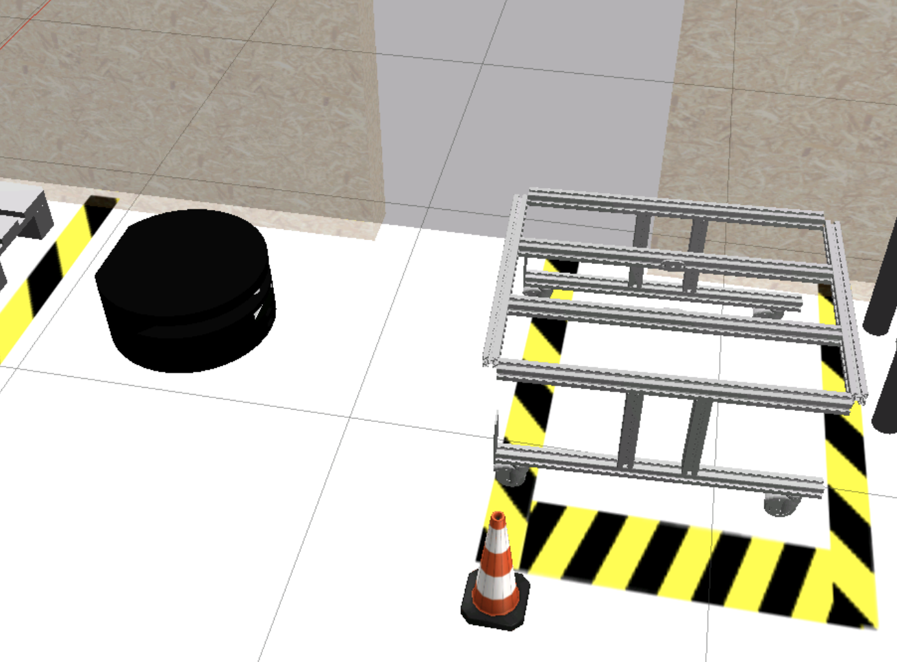

# Checkpoints 9 & 10 - Advanced ROS 2 / Node Composition

Two C++ ROS 2 packages that make an **RB1 robot** autonomously approach and attach to a shelf in a warehouse simulation. The robot uses **laser intensity detection** to find the shelf's reflective legs, publishes a **TF2 `cart_frame`** at the midpoint between them, and drives underneath the shelf using proportional control before lifting it with the elevator.

**Checkpoint 9** implements the behavior as standard ROS 2 nodes (`attach_shelf`). **Checkpoint 10** refactors the same logic into **composable components** (`my_components`) using `rclcpp_components`.

Part of the [ROS & ROS 2 Developer Master Class](https://www.theconstructsim.com/) certification (Phase 2).

<p align="center">
  
</p>

## How It Works

<p align="center">
  
</p>

### Pre-Approach Phase

1. Robot drives forward at 0.2 m/s toward the shelf
2. Front laser reading drops below the `obstacle` parameter threshold — robot stops
3. Waits 0.5 s for stabilization, captures current yaw from odometry
4. Rotates by `degrees` parameter (odometry-based yaw tracking with angle normalization)

### Final Approach Phase

1. After rotation, the `/approach_shelf` service is called
2. The service server scans laser intensities for two high-intensity blobs (> 1000) — the shelf's reflective leg markers
3. Computes the midpoint between the two legs in the laser frame
4. Transforms the midpoint to the `odom` frame using TF2 and publishes it as a static `cart_frame`
5. Drives toward `cart_frame` with a +0.5 m offset (to position the robot under the shelf)
6. Stops when within range of the target, publishes `"up"` to `/elevator_up` to lift the shelf

## Tasks Breakdown

This repo spans two checkpoints across two branches.

### Checkpoint 9 - Standard Nodes (`attach_shelf` package, branch: `main`)

#### Task 1 - Pre-Approach Node (branch: `task_1`)

- Created `pre_approach.cpp` with ROS 2 parameters (`obstacle`, `degrees`)
- Subscribes to `/scan` (front laser) and `/diffbot_base_controller/odom` (yaw)
- State machine: forward drive → obstacle stop → rotation → shutdown
- XML launch file `pre_approach.launch.xml` with configurable parameters

#### Task 2 - Service-Based Approach (branch: `task_2`)

- Created `approach_service_server.cpp` implementing the `/approach_shelf` service
- Laser intensity blob detection (threshold > 1000) to find two shelf legs
- TF2 coordinate transform from `robot_front_laser_base_link` to `odom` frame
- Static TF broadcast of `cart_frame` at the midpoint between shelf legs
- Proportional approach controller using `lookupTransform` from `robot_base_link` to `cart_frame`
- Publishes `"up"` to `/elevator_up` on arrival
- Created `pre_approach_v2.cpp` extending Task 1 with a service client (`final_approach` parameter)
- Python launch file `attach_to_shelf.launch.py` launching both nodes + RViz
- Custom service: `GoToLoading.srv` (`bool attach_to_shelf` → `bool complete`)

### Checkpoint 10 - Node Composition (`my_components` package, branch: `composition`)

#### Task 1 - Compose the Nodes

- Created `PreApproach` composable component replicating the pre-approach behavior
- Hardcoded `obstacle` (0.3) and `degrees` (-90) instead of parameters
- Registered with `RCLCPP_COMPONENTS_REGISTER_NODE` macro
- Loadable at runtime: `ros2 component load /ComponentManager my_components my_components::PreApproach`
- Header/source separation with `visibility_control.h` for DLL export macros

#### Task 2 - Final Approach

- Created `AttachServer` component (manual composition) containing the `/approach_shelf` service server
- Created `AttachClient` component (runtime composition) containing the service client
- Manual composition executable (`manual_composition.cpp`) using `SingleThreadedExecutor`
- `ComposableNodeContainer` launch file (`attach_to_shelf.launch.py`) loads `PreApproach` + `AttachServer` into `my_container`
- `AttachClient` loaded at runtime via `ros2 component load` to trigger the final approach

## ROS 2 Interface

| Name | Type | Description |
|---|---|---|
| `/scan` | `sensor_msgs/LaserScan` (sub) | Laser scanner data (ranges + intensities) |
| `/diffbot_base_controller/odom` | `nav_msgs/Odometry` (sub) | Robot odometry for yaw tracking |
| `/diffbot_base_controller/cmd_vel_unstamped` | `geometry_msgs/Twist` (pub) | Velocity commands to the robot |
| `/elevator_up` | `std_msgs/String` (pub) | Elevator lift command (`"up"`) |
| `/approach_shelf` | `GoToLoading` (service) | Triggers shelf detection and final approach |
| `odom` → `cart_frame` | TF2 (static broadcast) | Midpoint between the two shelf legs |

## Project Structure

```
checkpoint9/
├── attach_shelf/                    # Checkpoint 9: Standard ROS 2 nodes
│   ├── CMakeLists.txt
│   ├── package.xml
│   ├── launch/
│   │   ├── pre_approach.launch.xml        # Task 1 launch (XML)
│   │   └── attach_to_shelf.launch.py      # Task 2 launch (Python)
│   ├── rviz/
│   ├── src/
│   │   ├── pre_approach.cpp               # Task 1: drive + rotate
│   │   ├── pre_approach_v2.cpp            # Task 2: drive + rotate + service call
│   │   └── approach_service_server.cpp    # Task 2: shelf detection + approach
│   └── srv/
│       └── GoToLoading.srv
├── my_components/                   # Checkpoint 10: ROS 2 composable nodes
│   ├── CMakeLists.txt
│   ├── package.xml
│   ├── include/my_components/
│   │   ├── pre_approach.hpp
│   │   ├── attach_server.hpp
│   │   ├── attach_client.hpp
│   │   └── visibility_control.h
│   ├── launch/
│   │   └── attach_to_shelf.launch.py      # Component container launch
│   ├── rviz/
│   ├── src/
│   │   ├── pre_approach.cpp               # PreApproach component
│   │   ├── attach_server.cpp              # AttachServer component
│   │   ├── attach_client.cpp              # AttachClient component
│   │   └── manual_composition.cpp         # Manual composition executable
│   └── srv/
│       └── GoToLoading.srv
└── media/
```

## How to Use

### Prerequisites

- ROS 2 Humble
- Gazebo Classic 11
- RB1 robot simulation packages (`rb1_ros2_description`)

### Build

```bash
cd ~/ros2_ws
colcon build --packages-select attach_shelf my_components
source install/setup.bash
```

### Checkpoint 9 - Standard Nodes

```bash
# Task 1 - Pre-Approach Only
ros2 launch attach_shelf pre_approach.launch.xml obstacle:=0.3 degrees:=-90

# Task 2 - Full Shelf Attachment
ros2 launch attach_shelf attach_to_shelf.launch.py obstacle:=0.3 degrees:=-90 final_approach:=true
```

### Checkpoint 10 - Node Composition

```bash
# Task 1 - Load PreApproach component at runtime
ros2 run rclcpp_components component_container
# In another terminal:
ros2 component load /ComponentManager my_components my_components::PreApproach

# Task 2 - Launch container with PreApproach + AttachServer
ros2 launch my_components attach_to_shelf.launch.py
# In another terminal, load the client to trigger the final approach:
ros2 component load /my_container my_components my_components::AttachClient
```

## Git Branches

| Branch | Checkpoint | Description |
|---|---|---|
| `main` | 9 + 10 | All code merged (default) |
| `task_1` | 9 | Pre-approach node with parameterized drive and rotation |
| `task_2` | 9 | Service-based final approach with TF2 and elevator lift |
| `composition` | 10 | Composable nodes: PreApproach, AttachServer, AttachClient |

## Key Concepts Covered

### Checkpoint 9

- **Laser intensity detection**: finding reflective markers via `intensities[]` blob analysis
- **TF2 static broadcasting**: publishing `cart_frame` at runtime from computed coordinates
- **TF2 coordinate transforms**: `doTransform` from laser frame to odom frame
- **ROS 2 services**: custom `GoToLoading.srv` for decoupled approach triggering
- **ROS 2 parameters**: runtime-configurable `obstacle`, `degrees`, `final_approach`
- **State machines**: sequential phases (drive → stop → rotate → service call → approach → lift)

### Checkpoint 10

- **ROS 2 composition**: `rclcpp_components` shared libraries loaded into a single process
- **Runtime composition**: `ros2 component load` to dynamically add nodes to a running container
- **Manual composition**: `SingleThreadedExecutor` with explicitly instantiated component nodes
- **ComposableNodeContainer**: launch file that pre-loads components into a container
- **Visibility control**: `COMPOSITION_PUBLIC` / `COMPOSITION_LOCAL` DLL export macros
- **Header/source separation**: proper component class design with `.hpp` headers

## Technologies

- ROS 2 Humble
- C++ 17
- TF2 (`tf2_ros`, `tf2_geometry_msgs`)
- `rclcpp_components` (node composition)
- Gazebo Classic 11
